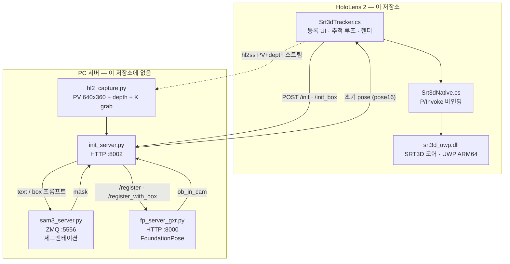

# [WISEUI 과제] On-device 3D Object Tracking (HoloLens 2)

HoloLens 2에서 **RGB 기반 3D 객체 추적(SRT3D)** 을 온디바이스로 수행하는 Unity(UWP/IL2CPP) 앱.
초기 pose는 PC의 **FoundationPose**(depth+mask)로 잡고, 그 이후 프레임은 디바이스에서 **SRT3D**
(region-based edge tracking)로 RGB만으로 추적한다. 등록 대상 영역은 헤드셋에서 직접 지정한다.

> 상태: 연구/프로토타입. 추적·등록은 동작하며, latency(=PhotoCapture 캡처 경로)와 텍스처 렌더는 진행 중.

---

## 이 저장소에 무엇이 있고 무엇이 없나

| | 내용 |
|---|---|
| ✅ **포함** | **HoloLens 클라이언트** — Unity(UWP/IL2CPP) 앱 전체 |
| ✅ **포함** | **`native/srt3d_uwp/`** — SRT3D 네이티브 플러그인 **소스와 빌드 스크립트** |
| ❌ **미포함** | **서버 컴포넌트** — `init_server.py`, `hl2_capture.py`, FoundationPose, SAM3 |
| ❌ **미포함** | **Microsoft SDK DLL 2개** — 독점 EULA 라 재배포 불가 ([복원 절차](#microsoft-sdk-dll-복원-선택), 빌드에 필수는 아님) |

> ⚠️ **서버 컴포넌트는 별도이며 아직 공개되지 않았다.**
> 등록(초기 pose 추정) 단계가 전부 서버에 있으므로, 현재 이 저장소만으로는
> 클라이언트를 **단독 실행할 수 없다.** 아래 「아키텍처」의 PC 쪽 블록이 그 부분이다.

---

## 아키텍처



> **핵심:** FoundationPose 와 SRT3D 가 **같은 PV 카메라를 기준으로 pose 를 다룬다.**
> 그래서 서버가 준 초기 pose 를 디바이스가 그대로 받아 쓴다 — **재투영도 좌표 변환도 없다.**

### 실행 흐름

1. **hl2ss(PV+depth) 스트림 ON** — PC 가 기기에서 프레임을 가져갈 수 있게 연다.
2. **등록** — 화면에서 대상 영역(box)을 지정하면 서버가 초기 pose 를 회신한다.
3. **hl2ss OFF → PhotoCapture(PV, RGB) ON** — PV 카메라는 배타 점유라 둘을 동시에 못 쓴다.
4. **매 프레임 `srt3d_track_rgb()`** → mesh 오버레이 렌더.

### 역할 분담

- **초기 pose**: FoundationPose 가 depth+mask 로 `ob_in_cam`(OpenCV) 6DoF pose 산출.
- **추적**: SRT3D 는 RGB-only. 매 프레임 mesh 를 내부 K 로 투영해 객체 윤곽과 맞춰 pose 갱신.
- **렌더 좌표**: Unity 는 `world = cam2world · S · M`
  (S = 180° about X, OpenCV↔Unity 카메라 규약 차이).

---

## 저장소 구조 (핵심만)

| 경로 | 설명 |
|---|---|
| `Assets/Scripts/Srt3dTracker.cs` | 메인 — 등록 UI + 추적 + 렌더 + 진단 HUD |
| `Assets/Scripts/Srt3dNative.cs` | `srt3d_uwp.dll` P/Invoke 바인딩 |
| `Assets/Plugins/WSA/ARM64/srt3d_uwp.dll` | SRT3D 네이티브 코어 (UWP ARM64) |
| `Assets/Editor/BuildScript.cs` | UWP export 자동화 (`Build > Export UWP (ARM64)`) |
| `Assets/StreamingAssets/srt3d/` | `model.obj`(렌더/추적 메시), `model.obj.meta`(SRT3D 뷰포인트 모델), `model_wire.obj` |
| `Assets/Scripts/hl2ss/` | hl2ss 스트리밍 부트스트랩 |
| **`native/srt3d_uwp/`** | **`srt3d_uwp.dll` 의 소스와 빌드 스크립트** — [빌드 절차](native/srt3d_uwp/README.md) |
| `docs/SRT3D_INTERFACE.md` | 네이티브 인터페이스 명세 (아래 「문서 읽는 법」 참고) |

### 네이티브 플러그인은 재빌드할 수 있다

`Assets/Plugins/WSA/ARM64/srt3d_uwp.dll` 은 **사전 빌드되어 포함**돼 있어 바로 쓸 수 있지만,
`native/srt3d_uwp/` 에 전체 소스와 빌드 스크립트가 있으므로 **소스에서 재빌드할 수 있다.**

- 빌드 절차: [`native/srt3d_uwp/README.md`](native/srt3d_uwp/README.md)
- 원본 대비 수정 내역: [`native/srt3d_uwp/MODIFICATIONS.md`](native/srt3d_uwp/MODIFICATIONS.md)

사전 준비물은 **OpenCV 4.11.0 의 UWP ARM64 정적 빌드 하나뿐**이다
(Eigen 은 CMake FetchContent 가 자동 처리, tiny_obj_loader 는 편입돼 있음).

> 2026-08-03 검증: 위 절차로 빌드한 DLL 이 저장소의 기존 DLL 과
> 크기·export 심볼·import·아키텍처가 모두 일치함을 확인했다.

### Microsoft SDK DLL 복원 (선택)

아래 두 DLL 은 **Microsoft 독점 EULA 라 재배포할 수 없어 저장소에 포함하지 않는다.**
해당 EULA 는 소프트웨어를 "share, publish, distribute, or lend" 하는 것을 금지하고
사용 범위를 개발·테스트로 한정한다.

| NuGet 패키지 | 버전 | 배치 위치 |
|---|---|---|
| `Microsoft.MixedReality.EyeTracking` | 1.0.2 | `Assets/Plugins/WSA/ARM64/Microsoft.MixedReality.EyeTracking.dll` |
| `Microsoft.MixedReality.SceneUnderstanding` | 1.0.14 | `Assets/Plugins/WSA/ARM64/Microsoft.MixedReality.SceneUnderstanding.dll` |

> ℹ️ **현재 구성에서는 없어도 빌드된다.** 정적 분석으로 확인한 근거:
> - C# 소스에 직접 호출이 없다
> - `MRTK.WSU.asmdef` 의 `precompiledReferences` 가 비어 있다
> - SceneUnderstanding 코드는 `com.microsoft.mixedreality.sceneunderstanding` 패키지가
>   있을 때만 컴파일되는데(`SCENE_UNDERSTANDING_PRESENT`), `Packages/manifest.json` 에 없다
> - MRTK 2.8.3 은 `Microsoft.MixedReality.EyeTracking` 을 참조하지 않는다
>   (MRTK 자체 `EyeGazeProvider`/OpenXR 을 쓴다. 이 DLL 은 별개의 Extended Eye Tracking SDK 다)
>
> **필수가 아니라, 원래 프로젝트에 있던 상태를 재현하려는 경우에만** 아래를 따르면 된다.

**복원 절차**

1. NuGet 에서 패키지를 받는다 (`nuget install <패키지명> -Version <버전>`,
   또는 <https://www.nuget.org/packages/Microsoft.MixedReality.EyeTracking> 에서 `.nupkg` 직접 다운로드 후 압축 해제)
2. 패키지 안의 **ARM64 / UWP 용** `.dll` 을 위 표의 경로에 복사한다
3. Unity Inspector 에서 각 DLL 을 선택하고 플랫폼을 설정한다:
   - `Any Platform` **해제**
   - `Windows Store Apps` **체크** → `CPU: ARM64`, `SDK: UWP`, `Scripting Backend: Il2Cpp`
   - `Editor` 해제

`.meta` 도 저장소에 없으므로 Unity 가 새로 생성한다. (`.dll` 만 빼고 `.meta` 를 남기면
존재하지 않는 파일을 가리키는 고아 참조가 되므로 둘 다 제외했다.)

---

### 서버 컴포넌트

PC 서버(`init_server.py`, `fp_server_gxr.py`, `hl2_capture.py`, SAM3)는
**별도이며 아직 공개되지 않았다.** 아래 「PC 서버 실행」 절은 인터페이스 참고용이다.

---

## 문서 읽는 법

[`docs/SRT3D_INTERFACE.md`](docs/SRT3D_INTERFACE.md) 는 1090행이다. 처음부터 읽지 말고
필요한 절만 볼 것:

| 하려는 일 | 볼 곳 |
|---|---|
| OpenCV 를 UWP ARM64 정적으로 빌드 | **§2.4** (+ [`native/srt3d_uwp/README.md`](native/srt3d_uwp/README.md)) |
| 네이티브 함수 호출 / 인자 타입 | **§3~4** — C ABI 6함수, 마샬링, `pose16` 규약 |
| pose 가 어긋나거나 뒤집힐 때 | **§5** — 좌표 규약. §5.4 증상별 판별표부터 볼 것 |
| 온디바이스 제약이 궁금할 때 | **§7** — GL 제거, `.meta` 사전생성, 스레딩, 성능 |
| 다른 트래커로 교체 | **§8** — 최소 계약 3함수 + 확인 항목 6가지 |
| 원본 대비 무엇을 고쳤나 | [`native/srt3d_uwp/MODIFICATIONS.md`](native/srt3d_uwp/MODIFICATIONS.md) |

---

## 테스트 환경

검증된 조합이다. 다른 버전에서의 동작은 확인되지 않았다.

### 클라이언트 / 네이티브 빌드

| 항목 | 버전 |
|---|---|
| Unity | **2022.3.62f3** (`96770f904ca7`) — UWP/IL2CPP, ARM64 |
| Visual Studio | **2022** v17 (MSVC 14.44.35207) + UWP 워크로드, ARM64 툴셋 |
| Windows SDK | 10.0.26100.0 |
| CMake | **4.2.0** |
| OpenCV | **4.11.0** (`core`, `imgproc` 만 / WindowsStore ARM64 static) |
| Eigen | **3.4.0** (FetchContent, `GIT_TAG 3.4.0`) |
| 디바이스 | HoloLens 2 (Device Portal 활성 / 개발자 모드) |

### 서버

| 항목 | 버전 |
|---|---|
| GPU | **[TBD]** |
| CUDA | **[TBD]** |
| PyTorch | **[TBD]** |
| OS / Python | **[TBD]** |

> 서버 컴포넌트가 아직 공개되지 않아 사양이 기재되지 않았다.

---

## 빌드 & 배포

Unity가 UWP VS 솔루션을 **export** 하고, MSBuild가 **Release/ARM64 msix**를 만든다.

> ℹ️ 아래 `Build/` 경로와 msix 패키지명에 쓰이는 `hololens2_wiseui` 는 Unity
> `productName`(`ProjectSettings/ProjectSettings.asset`) 에서 생성되는 이름이며,
> **저장소 이름(`wiseui-hl2-object-tracking`) 과 무관하다.** 앱 identity 가 바뀌면
> 기기에서 기존 앱을 지우고 재설치해야 하므로 의도적으로 그대로 두었다.

### 자동 (batchmode) — 에디터를 닫은 상태에서
```bash
# 1) Unity export (스크립트 변경 시 도메인 리로드로 1회차가 비면 2회 실행 필요)
"<UNITY_EDITOR_PATH>/2022.3.62f3/Editor/Unity.exe" -batchmode -quit \
  -projectPath . -executeMethod BuildScript.BuildUWP -logFile Build/export.log

# 2) MSBuild Release ARM64 → appx/msix
MSBuild.exe Build/hololens2_wiseui.sln -restore \
  /p:Configuration=Release /p:Platform=ARM64 \
  /p:UapAppxPackageBuildMode=SideloadOnly /p:AppxBundle=Never /p:AppxPackageSigningEnabled=true
```
산출물: `Build/AppPackages/hololens2_wiseui/hololens2_wiseui_1.0.0.0_ARM64_Test/*.msix`

> batchmode 주의: **스크립트를 방금 고쳤다면** 첫 배치 실행은 컴파일+도메인 리로드로
> `-executeMethod`가 버려져 export가 비어 나올 수 있다. Unity 완전 종료 후 **한 번 더** 실행하면 된다.

### 에디터에서
`Build > Export UWP (ARM64)` 메뉴 → 생성된 `Build/hololens2_wiseui.sln`을 VS에서 Release/ARM64로 배포.

### 배포
- **Device Portal**: `http://<HL2-IP>` → Views ▸ Apps → 기존 앱 Uninstall → Deploy apps ▸ Local Storage
  → `.msix` + `Dependencies/ARM64/Microsoft.VCLibs.ARM64.14.00.appx` → Install
- **VS**: 솔루션 열고 Release/ARM64/Remote Machine → F5

---

## 등록 방식 (`Srt3dTracker._initMode`)

| 모드 | 동작 | 서버 |
|---|---|---|
| `TextCenter` | 객체를 중앙에 두고 SAM `text='book'` 자동검출 | `GET /init` |
| `CenterBox` *(기본)* | 화면 중앙 **정사각형 박스**에 객체 맞추고 **핀치 1회** | `POST /init_box` |
| `CropPinch` | 두 모서리 air-tap 으로 박스 지정 | `POST /init_box` |
| `DragDraw` | 두 번 핀치(탭)로 두 모서리 지정 | `POST /init_box` |

핀치는 MRTK 손관절(엄지끝↔검지끝 거리, 히스테리시스)로 직접 감지 — 전역 포인터 클릭에 의존하지 않음.

---

## HUD 진단 값

- `fps` — 추적 프레임 처리율 (latency/버퍼링 정량화)
- `PV cap {W}x{H}` / `srt {W}x{H}` — 실제 캡처 해상도 / SRT3D 입력 해상도
- `ΔT / ΔR` — 프레임 간 pose 변화량 (책 움직일 때 뛰어야 정상; ≈0이면 추적 미갱신)
- `conf` — SRT3D 신뢰도
- `obj t=(x,y,z)m` — 초기 FP pose의 객체 위치 (z가 양수·0.2~1.5m면 정상)
- `[Srt3dTracker][DIAG]` 로그 — 지원 해상도 목록, 전체 K(fx,fy,cx,cy), kScale 등

---

## 주요 튜닝 (`Srt3dTracker.cs` 상단 `[TUNE]`)

- `_procMaxW` (기본 760) — 캡처 선택 목표 + SRT3D 입력 폭 상한. 초과 시 CPU downscale + K 동일비율 스케일.
- `_initMode`, `_centerBoxW` — 등록 방식/박스 크기
- `_serverBaseUrl` — PC init_server 주소. **Inspector 에 노출된 필드**다
  (`Srt3dTracker` 컴포넌트 ▸ Server Base Url). 형식 `http://<SERVER_IP>:<PORT>`,
  기본값 `http://127.0.0.1:8002`. `/init` 과 `/init_box` 경로는 여기서 파생된다
- `_axisFlip` — OpenCV↔Unity 렌더 좌표

해상도 처리: PhotoCapture가 4K를 고르면 SRT3D region matching이 과부하되어 추적이 멈추고 fps가
바닥난다. 그래서 지원 목록 중 `_procMaxW`에 **가장 가까운** 해상도를 선택하고, BGRA→RGB 변환과
축소를 **한 번의 strided 샘플로 융합**해 프레임당 비용을 SRT3D 해상도에만 비례하게 유지한다.

---

## PC 서버 실행

> ⚠️ **서버 컴포넌트는 아직 공개되지 않았다.** 아래는 클라이언트가 기대하는
> 엔드포인트와 기동 구성을 적은 **인터페이스 참고용**이다.

서버는 **3개 프로세스**로 나뉜다. 등록(초기 pose 추정) 한 번에 셋이 모두 관여한다.

| # | 프로세스 | 실행 환경 | 엔드포인트 | 역할 |
|---|---|---|---|---|
| 1 | `init_server.py` | Windows | HTTP `:8002` | **클라이언트 진입점.** `/init`, `/init_box` 를 받아 SAM3 → FoundationPose 순으로 중계하고 pose 를 회신 |
| 2 | `sam3_server.py` | WSL2 (conda) | ZMQ `tcp://*:5556` | 텍스트/박스 프롬프트 세그멘테이션 → mask 반환 |
| 3 | `fp_server_gxr.py` | WSL2 → Docker | HTTP `:8000` | FoundationPose 초기 pose 추정 (`/register`, `/register_with_box`) |

`init_server` 만 디바이스와 직접 통신한다. 나머지 둘은 `init_server` 가 호출한다.
PV+depth+K 프레임은 `hl2_capture.py` 가 hl2ss 로 기기에서 가져온다
(별도 리스닝 프로세스가 아니라 `init_server` 가 쓰는 모듈로 보인다 — **[확인 필요]**).

환경변수: `HL2_HOST`(hl2ss 기기 IP), `FP_URL`, `SAM3_ADDR`, `OBJ_TEXT`, `INIT_PORT`.

### 외부 의존성

| 프로젝트 | URL | 실행 방식 |
|---|---|---|
| **FoundationPose** | <https://github.com/NVlabs/FoundationPose> | **Docker 기반.** WSL2 에서 컨테이너로 실행 |
| **SAM3** | <https://github.com/facebookresearch/sam3> | **WSL2 conda 환경에서 직접 실행.** Docker 불필요 |

설치·모델 가중치 준비는 각 upstream 문서를 따를 것. 여기서는 다루지 않는다.

### 워크스페이스 배치

> 🚫 **서버 스크립트 4개는 아직 공개되지 않았다** — `init_server.py`, `hl2_capture.py`,
> `fp_server_gxr.py`, `sam3_server.py`. **현재 이 파일들을 받을 수 있는 곳은 없다.**
> 아래 구조는 공개 시 어디에 놓이는지를 미리 밝혀두는 것이다.

```
<WORKSPACE>/
├── hl2_pipeline/                  # 독립 폴더 (upstream 없음)
│   ├── init_server.py             🚫 미공개
│   └── hl2_capture.py             🚫 미공개
├── FoundationPose/                # git clone NVlabs/FoundationPose
│   ├── my_data/joke_book/textured_meshes/*.obj
│   └── fp_server_gxr.py           🚫 미공개 — upstream 에 없음. 여기에 배치
├── SAM3/                          # git clone facebookresearch/sam3
│   └── sam3_server.py             🚫 미공개 — upstream 에 없음. 여기에 배치
└── wiseui-hl2-object-tracking/    # 이 저장소
```

**`fp_server_gxr.py` 와 `sam3_server.py` 는 각 upstream 저장소의 루트에 놓인다.**
그래야 해당 프로젝트의 모듈을 import 할 수 있고, 상대경로 인자가 성립한다.
`docs/SRT3D_INTERFACE.md` §9.3 에 기록된 실행 명령이 이를 보여준다:

```bash
# 작업 디렉터리 = FoundationPose 루트
python fp_server_gxr.py --mesh my_data/joke_book/textured_meshes/joke_book_hl2c.obj
```

`--mesh` 가 상대경로이므로 스크립트는 FoundationPose 루트에서 실행된다.
`sam3_server.py` 도 같은 이유로 SAM3 루트에 두는 것으로 보이나, 실행 명령이
문서에 남아 있지 않아 **[확인 필요]** 다.

### mesh 배치 — 클라이언트와 같은 물체여야 한다

FoundationPose 는 `--mesh` 로 obj 를 받는다. 이 mesh 와 클라이언트의
`Assets/StreamingAssets/srt3d/model.obj` 는 **반드시 같은 물체여야 한다.**
서로 다르면 서버가 준 초기 pose 가 디바이스의 추적 모델과 맞지 않아 **추적이 어긋난다.**

> ⚠️ **HoloLens 용 mesh 는 `joke_book_hl2c.obj` 다.**
> 같은 폴더의 `optimized_poisson_texture_mapped_mesh.obj` 는 **Galaxy XR 과 공유하는 원본**이고,
> HoloLens 에 쓰면 안 된다. 이 원본은 원점이 bbox 중심에서 10.3 cm 벗어나 있어
> `max_body_diameter` 가 2배로 부풀고, 그 결과 SRT3D 가 tilt 를 구분하지 못한다
> (`docs/SRT3D_INTERFACE.md` §9.1). `joke_book_hl2c.obj` 는 그 문제를 고친 재정렬본이다.
> `.mtl` / `.png` 텍스처는 원본과 공유한다.

mesh 를 바꾸면 `.meta`(SRT3D 뷰포인트 모델)도 함께 재생성해야 한다 —
[`native/srt3d_uwp/README.md`](native/srt3d_uwp/README.md) §5 참조.

### 기동 순서

```
init_server (8002)  →  sam3_server (5556)  →  fp_server (8000)  →  HoloLens 앱
```

역순으로 켜도 무방하지만, **셋이 모두 떠 있어야 등록이 성공한다.**
디바이스 앱을 켜기 전에 **standalone hl2ss 앱은 종료**해야 한다 — PV 카메라를 배타 점유하므로
앱과 충돌한다.

각 서버의 기동 성공 신호(로그 문구·헬스 엔드포인트)는 **[확인 필요]** — 서버 코드가
이 저장소에 없어 확인할 수 없다. 최소 확인은 세 포트가 LISTEN 상태인지 보는 것이다.

---

## 알려진 이슈 / TODO

- **Latency** — PhotoCapture(정지사진 API)를 루프로 도는 구조라 프레임당 지연이 남을 수 있음.
  해상도로 안 풀리면 **MediaFrameReader(비디오 프레임 소스)** 로 전환 필요(설계 변경).
- **Depth 없음** — SRT3D가 RGB-only라 원근/스케일을 실루엣으로만 추정. 해상도가 낮으면 취약.
- **텍스처 렌더** — 현재 `model.obj`를 solid opaque로 렌더. 실제 표지 텍스처는 OBJ+MTL+UV 로딩 추가 필요.
- ~~서버 IP 하드코딩~~ → `_serverBaseUrl` 로 Inspector 노출 완료.
  대상 모델명(`book` / `joke_book`)은 아직 `_boxText` 등에 하드코딩 — 설정화 필요.

---

## 출처 및 수정 내역

이 프로젝트가 기반으로 삼은 외부 작업:

- **SRT3D** — Stoiber et al., Sparse Region-based 3D Object Tracking
- **FoundationPose** — NVIDIA
- **hl2ss** — HoloLens 2 sensor streaming
- **MRTK** — Mixed Reality Toolkit (입력/핸드 트래킹)

### `native/srt3d_uwp/srt3d/` 의 파생 관계

```
Upstream:     DLR-RM/3DObjectTracking @ 11ae750
Intermediate: pysrt3d (fork point not recorded)
```

`native/srt3d_uwp/srt3d/` 는 **pysrt3d 에서 파생된 수정 스냅샷**이며 stock SRT3D 가 아니다.
patch series 가 아니라 **전체 스냅샷**으로 포함했는데, 이는 **pysrt3d 포크 시점이 기록되지
않아 patch 를 뜰 기준 커밋을 특정할 수 없기 때문**이다.

> 위 `11ae750` 은 **DLR-RM/3DObjectTracking 의 커밋**이다. pysrt3d 의 커밋이 아니다.

수정 항목별 상세(무엇을/왜/어느 파일·함수)는
[`native/srt3d_uwp/MODIFICATIONS.md`](native/srt3d_uwp/MODIFICATIONS.md) 참고.

---

## 라이선스

**이 프로젝트가 직접 작성한 코드는 MIT** 다 — [`LICENSE`](LICENSE).

> ### ⚠️ 다만 저장소 전체를 "MIT" 로 표기할 수 없다
>
> 번들된 서드파티 중 일부가 MIT 보다 강한 제약을 부과한다. 특히:
>
> **`hl2ss` 는 BSD 3-Clause 에 Commons Clause 조건이 붙어 있다.**
> 이 조항은 소프트웨어의 **판매**, 그리고 그 기능에 가치가 실질적으로 의존하는
> 제품·서비스의 유상 제공(유상 호스팅·컨설팅·지원 포함)을 금지한다.
> 저장소가 `hl2ss.dll` 과 `Assets/Scripts/hl2ss/hl2ss.cs` 를 재배포하므로
> **배포물 전체가 이 제약을 승계한다 — 상업적으로 판매할 수 없다.**
>
> Commons Clause 는 OSI 승인 오픈소스 조건이 **아니다.**

그 밖에 유의할 항목:

| 구성요소 | 라이선스 | 유의점 |
|---|---|---|
| hl2ss | BSD 3-Clause + **Commons Clause** | 판매 금지. 인용 요청 (arXiv:2211.02648) |
| OpenCV 4.11.0 | Apache 2.0 | `srt3d_uwp.dll` 에 정적 링크됨 |
| zlib | zlib License | OpenCV 경유로 정적 링크됨 |
| Eigen 3.4.0 | MPL 2.0 | `EIGEN_MPL2_ONLY` 로 LGPL 미접촉 확인 |
| TextMesh Pro | Unity Companion License | 범용 오픈소스 아님. Unity 밖 재사용 불가 |
| ~~EmojiOne~~ | — | 라이선스 조건 불명 → **저장소에서 삭제됨** |
| MS MR SDK DLL 2개 | 독점 EULA | **재배포 불가 — 저장소 미포함** |

전체 목록·저작권 고지·라이선스 전문은
**[`THIRD_PARTY_NOTICES.md`](THIRD_PARTY_NOTICES.md)** 참조.
